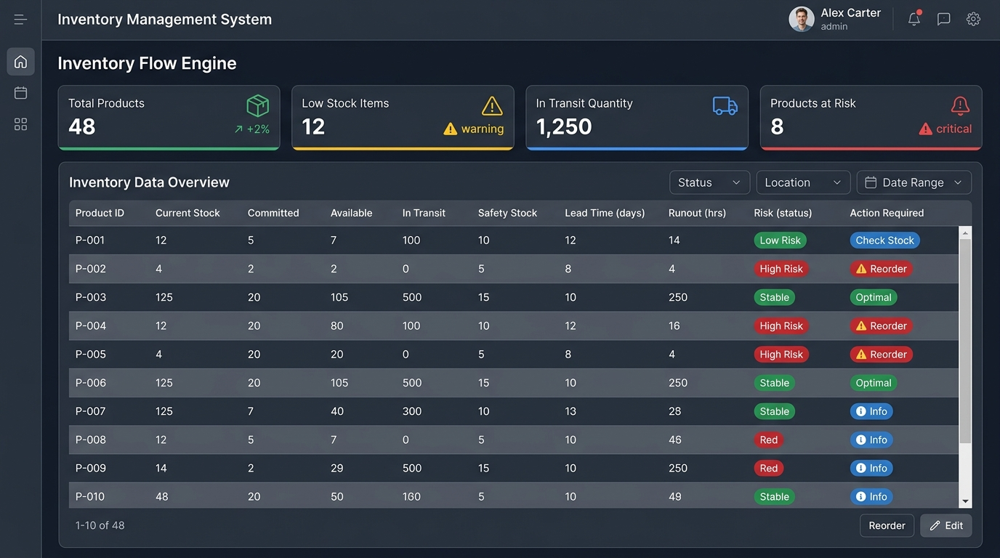
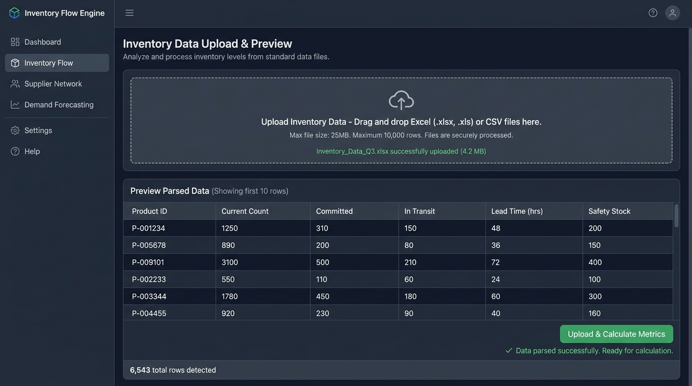
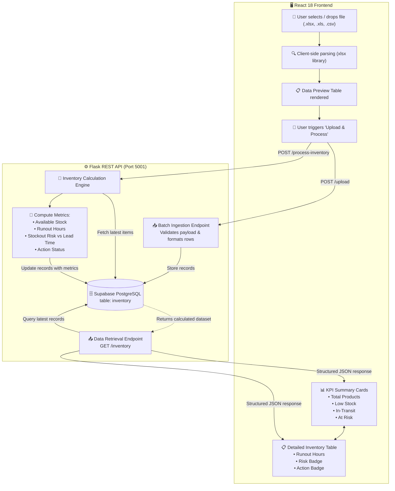
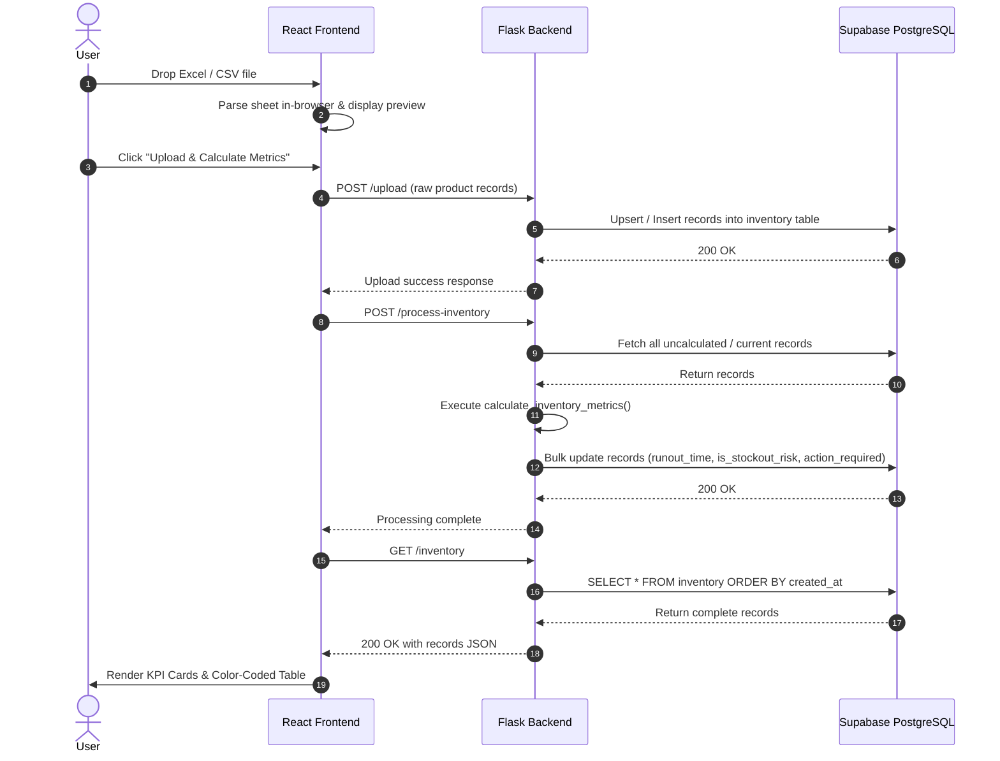

# 📦 Inventory Flow Engine

[](https://react.dev/)
[](https://flask.palletsprojects.com/)
[](https://supabase.com/)
[](https://python.org/)
[](LICENSE)

**Inventory Flow Engine** is a full-stack inventory analytics and stock health management platform. It allows supply chain and inventory teams to ingest bulk stock reports (`.xlsx`, `.xls`, `.csv`), compute replenishment metrics (available stock, runout burn hours, stockout vulnerability, lead-time mismatch), and make data-driven decisions via an interactive dashboard with actionable priority badges.

---

## 📸 Application Screenshots

### 1. Inventory KPI Dashboard & Risk Analysis Table
Displays high-level KPI summary cards (Total Products, Low Stock Items, In-Transit Quantity, Products at Risk) alongside an actionable inventory table showing real-time runout hours and prioritized replenishment alerts.



### 2. File Upload & Ingestion Preview
Provides a seamless drag-and-drop file ingestion zone with instant client-side Excel/CSV parsing, schema validation preview, and single-click metric processing.



---

## ⚡ Key Features

- **Multi-Format Ingestion**: Drag-and-drop parsing for `.xlsx`, `.xls`, and `.csv` files using client-side spreadsheet workers.
- **Immediate Data Preview**: Inspect raw rows, detected columns, and record counts prior to backend ingestion.
- **Automated Metric Engine**:
  - **Available Stock**: Computes true usable inventory (`current_stock - committed_stock`).
  - **Runout Hours**: Evaluates operational burn rate based on daily demand velocity.
  - **Stockout Risk Detection**: Automatically flags products where lead-time replenishment cannot outpace runout time.
  - **Tiered Action Recommendations**: Classifies urgent inventory actions from healthy stock to emergency reorders.
- **Executive KPI Cards**: Real-time aggregation of total catalog items, items below safety threshold, in-transit units, and high-risk products.
- **Color-Coded Status Badges**: Visual risk indicators (🔴 High Risk, 🟢 Low Risk) and priority badges (🚨 Critical, 🔴 Expedite, 🟡 Caution, ✅ Healthy).
- **Persistent Data Store**: Powered by PostgreSQL on Supabase with Row Level Security (RLS) enabled.
- **Safe Maintenance Tools**: One-click catalog refresh and full catalog purge with confirmation modals.

---

## 🔄 System Architecture & Workflow

The diagram below illustrates the end-to-end lifecycle of an inventory batch, from file ingestion to metric evaluation and dashboard rendering:



### Detailed Sequence Flow



---

## 📐 Inventory Metric Logic & Formulas

The core analytical engine in [`backend/app.py`](backend/app.py) evaluates stock positions according to standard supply chain control models:

### 1. Available Stock
$$\text{Available Stock} = \text{Current Inventory Count} - \text{Committed Stock Count}$$

### 2. Hourly Demand & Expected Runout Time
Using the configured daily demand rate ($\text{Daily Demand} = 10\text{ units/day}$ by default):
$$\text{Hourly Demand} = \frac{\text{Daily Demand}}{24}$$

$$\text{Runout Time (hours)} = \frac{\text{Available Stock}}{\text{Hourly Demand}}$$

### 3. Stockout Vulnerability Risk
A stockout risk occurs when remaining usable stock will run out before supplier replenishment arrives:
$$\text{is\_stockout\_risk} = \begin{cases} \text{true}, & \text{if } \text{Runout Time (hours)} \le \text{Supplier Lead Time (hours)} \\ \text{false}, & \text{otherwise} \end{cases}$$

### 4. Action Recommendation Matrix

| Condition | Risk Category | Recommended Action Badge |
| :--- | :--- | :--- |
| $\text{Available Stock} \le 0$ | 🚨 Immediate Out of Stock | `🚨 IMMEDIATE ACTION: OUT OF STOCK! Reorder now!` |
| $\text{Available Stock} \le \text{Safety Stock}$ | 🔴 Critical Stock | `🔴 CRITICAL: Reorder Immediately - Below Safety Stock` |
| $\text{is\_stockout\_risk} = \text{true}$ | 🟠 High Priority | `🟠 HIGH PRIORITY: Expedite Order - Will run out before replenishment` |
| $\text{Available Stock} \le \text{Safety Stock} \times 1.5$ | 🟡 Caution | `🟡 CAUTION: Monitor Inventory - Approaching Safety Stock` |
| Default | 🟢 Healthy | `✅ Stock level healthy - Monitor regularly` |

---

## 🗂️ Project Structure

```text
inventory-flow-engine/
├── backend/
│   ├── app.py                   # Flask REST server & calculation engine
│   ├── requirements.txt         # Python dependencies
│   └── .env.example             # Backend environment template
├── database/
│   └── schema.sql               # Supabase PostgreSQL DDL & RLS policies
├── docs/
│   └── screenshots/             # Visual documentation assets
│       ├── dashboard_overview.jpg
│       └── file_upload_preview.jpg
├── frontend/
│   ├── public/                  # Static assets & HTML template
│   ├── src/
│   │   ├── components/
│   │   │   ├── FileUpload.js    # Dropzone & sheet ingestion component
│   │   │   └── FileUpload.css   # Dropzone & preview table styles
│   │   ├── services/
│   │   │   └── supabase.js      # API bridge service (upload, fetch, delete)
│   │   ├── App.js               # Main application container, KPIs & data table
│   │   ├── App.css              # Dashboard layout & badge styles
│   │   ├── index.js             # React DOM root entrypoint
│   │   └── index.css            # Global design tokens
│   ├── package.json             # NPM scripts & dependencies
│   └── .env.example             # Frontend environment template
└── README.md                    # Project documentation
```

---

## 🛠️ Tech Stack & Dependencies

### Frontend
- **Framework**: [React 18.2](https://react.dev/)
- **File Parsing**: [xlsx (SheetJS) 0.18.5](https://docs.sheetjs.com/)
- **File Handling**: [react-dropzone 14.2](https://react-dropzone.js.org/)
- **Notifications**: [react-hot-toast 2.4](https://react-hot-toast.com/)
- **Database Client**: [@supabase/supabase-js 2.38](https://supabase.com/docs/reference/javascript)

### Backend
- **Framework**: [Flask 3.x](https://flask.palletsprojects.com/)
- **CORS Handling**: [Flask-CORS](https://flask-cors.readthedocs.io/)
- **Database Client**: [supabase-py](https://github.com/supabase-community/supabase-py)
- **Data Manipulation**: [pandas](https://pandas.pydata.org/)
- **Configuration**: [python-dotenv](https://github.com/theskumar/python-dotenv)

### Database
- **Platform**: [Supabase](https://supabase.com/) (Managed PostgreSQL)
- **Features**: Row Level Security (RLS), custom indexed tables, timestamp tracking.

---

## 🚀 Getting Started

### Prerequisites

- **Python**: 3.9 or higher
- **Node.js**: v16.x or higher & npm
- **Supabase Account**: A free Supabase project with PostgreSQL access

---

### Step 1: Database Setup (Supabase)

1. Open your [Supabase Dashboard](https://supabase.com/dashboard) and create a project.
2. In the left navigation, navigate to **SQL Editor**.
3. Copy the contents of [`database/schema.sql`](database/schema.sql) and paste them into the SQL Editor.
4. Execute the query. This sets up the following tables:
   - `inventory` (main table storing inventory records and calculated KPIs)
   - `inventory_temp` (staging table with session-level isolation)
   - Indexes and Row Level Security (RLS) policies.

---

### Step 2: Backend Setup

1. Open a terminal and navigate to the `backend` folder:
   ```bash
   cd backend
   ```

2. Create and activate a Python virtual environment:
   ```bash
   # macOS / Linux
   python3 -m venv .venv
   source .venv/bin/activate

   # Windows
   python -m venv .venv
   .venv\Scripts\activate
   ```

3. Install required Python packages:
   ```bash
   pip install -r requirements.txt
   ```

4. Create your backend configuration file `backend/.env`:
   ```bash
   cp .env.example .env   # Or create .env manually
   ```
   Add your Supabase credentials:
   ```env
   SUPABASE_URL=https://your-project-id.supabase.co
   SUPABASE_KEY=your_supabase_anon_key
   TABLE_NAME=inventory
   PORT=5001
   ```

5. Launch the Flask API server:
   ```bash
   python app.py
   ```
   *The server starts on `http://localhost:5001`.*

---

### Step 3: Frontend Setup

1. Open a second terminal and navigate to the `frontend` folder:
   ```bash
   cd frontend
   ```

2. Install dependencies:
   ```bash
   npm install
   ```

3. Create the frontend environment configuration file `frontend/.env`:
   ```env
   REACT_APP_API_URL=http://localhost:5001
   REACT_APP_SUPABASE_URL=https://your-project-id.supabase.co
   REACT_APP_SUPABASE_KEY=your_supabase_anon_key
   REACT_APP_TABLE_NAME=inventory
   ```

4. Start the React development server:
   ```bash
   npm start
   ```
   *The application will open automatically at `http://localhost:3000`.*

---

## 📄 File Ingestion Format

The engine expects `.xlsx`, `.xls`, or `.csv` files containing inventory records with the following headers (case-insensitive and supports camelCase or snake_case):

| Column Name | Type | Description | Example |
| :--- | :--- | :--- | :--- |
| `product_id` | String | Unique product or SKU identifier | `P-10024` |
| `current_inventory_count` | Integer | On-hand quantity currently in warehouse | `140` |
| `committed_stock_count` | Integer | Units reserved for confirmed orders | `35` |
| `in_transit_quantity` | Integer | Purchase order units currently being shipped | `50` |
| `supplier_lead_time_hours` | Float | Hours required for supplier to deliver restock | `48.0` |
| `safety_stock_level` | Integer | Minimum threshold buffer before risk alert | `30` |

### Sample CSV Snippet

```csv
product_id,current_inventory_count,committed_stock_count,in_transit_quantity,supplier_lead_time_hours,safety_stock_level
SKU-1001,150,25,50,48.0,30
SKU-1002,40,35,0,72.0,20
SKU-1003,500,100,200,96.0,80
SKU-1004,15,15,100,24.0,25
SKU-1005,85,10,40,36.0,20
```

---

## 📡 REST API Reference

| Method | Endpoint | Description | Request Body | Response |
| :--- | :--- | :--- | :--- | :--- |
| `GET` | `/` | Health check endpoint | None | `{"status": "healthy", "message": "..."}` |
| `POST` | `/upload` | Ingests parsed inventory rows | `[ { product_id, current_inventory_count, ... } ]` | `{"success": true, "count": N}` |
| `POST` | `/process-inventory` | Executes calculations and updates all rows | None | `{"success": true, "processed_count": N}` |
| `GET` | `/inventory` | Fetches all inventory records with metrics | None | `{"success": true, "data": [ ... ]}` |
| `POST` | `/delete-all` | Purges all records from active table | None | `{"success": true, "message": "All data deleted"}` |

---

## 🛡️ Security & Best Practices

- **Row Level Security (RLS)**: Default SQL policies are provided in [`database/schema.sql`](database/schema.sql). Ensure production deployments restrict anonymous write access to authenticated roles.
- **Environment Isolation**: Never commit active API keys or Supabase secrets to version control. Always utilize `.env` files.
- **Data Validation**: Both frontend (`readExcelFile`) and backend (`safe_int`, `safe_float`) implement defensive casting to prevent NaN and null propagation.

---

## 👥 Contributors & Core Team

| Contributor | Role | GitHub | Key Responsibilities |
| :--- | :--- | :--- | :--- |
| **Neel Belsare** | Full-Stack Architect & Core Developer | [@Neel-Belsare](https://github.com/Neel-Belsare) | Backend architecture, calculation engine, database schema, React dashboard UI, visual system diagrams |
| **Mansi Gaike** | Project Owner & Systems/Docs Lead | [@gaikemansi03-sketch](https://github.com/gaikemansi03-sketch) | Repository ownership, functional specifications, technical documentation, API specifications, QA validation |

### 🛠️ Task & Contribution Breakdown

#### 🔹 Neel Belsare ([@Neel-Belsare](https://github.com/Neel-Belsare))
- **System Architecture & Design**:
  - Designed the end-to-end full-stack decoupled architecture integrating the React frontend, Flask analytical microservice, and Supabase PostgreSQL data layer.
  - Formulated the repository directory structure (`backend/`, `frontend/`, `database/`, `docs/`).
- **Backend Analytics Engine (`backend/app.py`)**:
  - Engineered the analytical calculation pipeline (`calculate_inventory_metrics`):
    - Real-time usable available stock computation (`current_inventory_count - committed_stock_count`).
    - Dynamic operational hourly burn rate and runout time estimation based on daily demand velocity.
    - Automated stockout vulnerability identification comparing runout time against supplier lead times (`runout_time <= supplier_lead_time`).
    - Priority-based action rule hierarchy (Immediate Out-of-Stock, Critical Low Stock, High Priority Expedite, Caution, and Healthy stock).
  - Implemented defensive data sanitization routines (`safe_int`, `safe_float`) protecting against missing or corrupt inputs.
- **RESTful API Service (`backend/app.py`)**:
  - Built Flask REST endpoints: `/upload` (batch payload ingestion), `/process-inventory` (metric calculation trigger), `/inventory` (data retrieval), and `/delete-all` (safe purge).
  - Configured CORS cross-origin handling and environment variable management via `python-dotenv`.
- **Database Architecture & Policies (`database/schema.sql`)**:
  - Authored PostgreSQL DDL defining persistent `inventory` and session-isolated `inventory_temp` tables.
  - Structured database performance indexes for optimized querying on `session_id`, `process_status`, and `product_id`.
  - Implemented Row Level Security (RLS) policies and automatic `moddatetime` timestamp triggers.
- **Frontend Dashboard Development (`frontend/src/`)**:
  - Built the React 18 dashboard interface featuring 4 key executive KPI summary cards (Total Products, Low Stock Items, In-Transit Volume, Products at Risk).
  - Implemented the color-coded inventory risk matrix with dynamic badge assignment (🔴 High Risk, 🟢 Low Risk, 🚨 Critical, etc.).
  - Built client-side Excel/CSV parsing engine with `xlsx` (SheetJS) and drag-and-drop file ingestion with `react-dropzone`.
  - Created service bridge (`frontend/src/services/supabase.js`) coordinating ingestion, metric calculation, and data polling.
  - Implemented interactive UX safeguards including deletion confirmation modals and toast feedback (`react-hot-toast`).
- **Documentation & Visual Architecture**:
  - Created detailed Mermaid flowchart and sequence flow architectural diagrams.
  - Documented mathematical formulations for stock calculation models.
  - Captured and integrated application user interface screenshots.

#### 🔹 Mansi Gaike ([@gaikemansi03-sketch](https://github.com/gaikemansi03-sketch))
- **Repository Setup & Management**:
  - Created and maintained the core repository (`gaikemansi03-sketch/inventory-flow-engine`).
  - Managed version control settings, branches, and collaborator access.
- **Product Definition & Functional Requirements**:
  - Defined business problem statement, core system objectives, and functional workflows for supply chain inventory tracking.
  - Specified key metrics required for stock replenishment operations (Available Stock, Lead Time vs. Burn Rate, Safety Stock thresholds).
  - Outlined requirement specifications for file ingestion formats (.xlsx, .xls, .csv) and column mappings.
  - Defined status badge categorization criteria and user-facing action recommendations.
- **Technical Documentation & Project Specification**:
  - Authored initial project documentation and developer onboarding blueprints.
  - Documented system prerequisites (Python 3.9+, Node.js 16+, Supabase setup).
  - Produced comprehensive REST API specifications detailing endpoints, request payloads, and response structures.
  - Formatted data ingestion templates, sample datasets, and schema field descriptions.
- **Quality Assurance & Workflow Validation**:
  - Conducted end-to-end testing of file ingestion across various spreadsheet schemas and row counts.
  - Verified edge cases in calculation metrics (e.g., zero available stock, lead-time mismatch, null field fallbacks).
  - Validated frontend dashboard states, including empty states, loading indicators, and notification toasts.

---

## 🤝 Contributing

Contributions are welcome! Please follow these steps:
1. Fork the repository.
2. Create a feature branch (`git checkout -b feature/enhancement-name`).
3. Commit your changes (`git commit -m 'Add awesome feature'`).
4. Push to the branch (`git push origin feature/enhancement-name`).
5. Open a Pull Request.

---

## 📜 License

This project is open source and available under the [MIT License](LICENSE).

